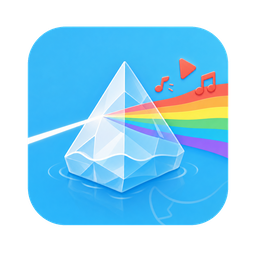

<p align="center">
  
</p>

<h1 align="center">OshiClip</h1>

<p align="center"><em>Clip the moment. Keep your oshi.</em></p>

以 Tauri v2、React 與 Rust 製作的跨平台直播片段下載工具。使用者可透過圖形介面輸入 YouTube 網址與起訖時間；應用程式會自行管理、驗證並執行 yt-dlp、ffmpeg 與 Deno，不需操作終端機。

OshiClip 可獨立使用，也能承接 [vods.oshi.tw](https://vods.oshi.tw) 產生的片段參數。

## 開發

```bash
npm install
npm run tauri dev
```

僅預覽前端介面可使用 `npm run dev`。瀏覽器模式會使用本機模擬資料，不會下載或執行任何二進位檔。

## 驗證

```bash
npm run check
npx tauri build --no-bundle
```

macOS bundle 產出後，可額外確認簽章、Cargo lockfile 不含 `xz2` / `lzma-sys`，且執行檔只動態連結 Apple 系統函式庫：

```bash
npm run verify:macos
```

`.tar.xz` 解壓使用純 Rust 的 `lzma-rust2`，不會載入 Homebrew `liblzma`。Tauri 在 macOS 上仍會動態連結 AppKit、WebKit、Foundation 與 `libSystem`；這些是作業系統提供的必要 framework，不屬於需隨 App 打包的第三方 dylib。

### Windows x64

Windows release 使用 `x86_64-pc-windows-msvc`，並透過 [`.cargo/config.toml`](./.cargo/config.toml) 將 MSVC CRT 靜態編入。[`build.rs`](./src-tauri/build.rs) 會停用 Tauri 2.11 僅靜態化 VCRUNTIME、但仍動態載入 UCRT 的 legacy override，並在缺少 `crt-static` target feature 時直接中止 build。Tauri 仍會使用 Windows 系統 DLL 與 Microsoft WebView2；安裝器會內嵌 WebView2 bootstrapper，當系統缺少 runtime 時再由 Microsoft 安裝。

請在 Windows 主機執行：

```powershell
npm ci
npm run tauri -- build --target x86_64-pc-windows-msvc --bundles nsis,msi
npm run verify:windows
```

Windows build 必須明確指定 target，確保 Cargo 套用 `x86_64-pc-windows-msvc` 的 `+crt-static` 設定。驗證腳本會拒絕動態 MSVC/UCRT、非系統 DLL、錯誤架構，以及缺少 NSIS 或 MSI 的 build。公開發佈前仍需加入可信任的 Authenticode 憑證，否則 Windows SmartScreen 會顯示未知發行者警告。

## CI 與發布

[`Native build and release`](./.github/workflows/native-release.yml) 會在 pull request、`main` push 與手動觸發時執行完整檢查，並產生下列可保留 14 天的 Actions artifacts：

- macOS arm64 DMG（僅支援 Apple Silicon）
- Windows x64 NSIS installer
- Windows x64 MSI installer

推送符合目前應用程式版本的 `vX.Y.Z` tag 後，workflow 會建立或更新 GitHub Release，附上三個安裝檔與 `SHA256SUMS.txt`：

```bash
npm run check:version
version="$(node -p "require('./package.json').version")"
git tag "v$version"
git push origin "v$version"
```

`package.json`、`src-tauri/tauri.conf.json` 與 `src-tauri/Cargo.toml` 的版本必須一致，tag 也必須是相同版本加上 `v` 前綴。現階段 macOS 使用 ad-hoc 簽章但尚未 notarize，Windows installer 也尚未 Authenticode 簽署；CI 產物適合測試與早期開源發布，正式面向一般使用者前仍應配置平台憑證。

完整產品與安全設計請見 [`oshiclip-desktop-design.md`](./oshiclip-desktop-design.md)；目前界面的功能、佈局、狀態與 UX 討論題請見 [`UI-spec.md`](./UI-spec.md)。

## 授權

本專案原始碼採用 [Apache License 2.0](./LICENSE) 授權。

應用程式在執行期下載及呼叫的 yt-dlp、ffmpeg 與 Deno 不屬於本專案散布內容，並各自適用其原作者提供的授權條款。
