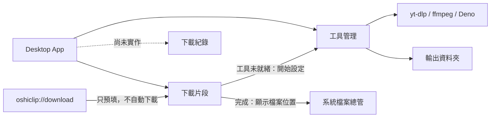
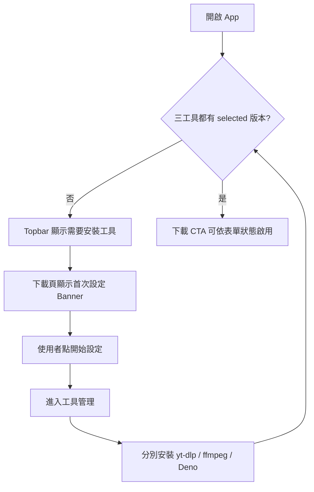
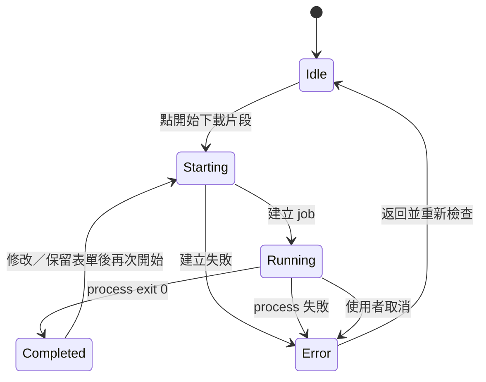

# OshiClip — UI/UX 現況規格

| 項目 | 內容 |
|---|---|
| 文件目的 | 描述目前已實作 UI 的功能、資訊架構、佈局與狀態，作為產品／設計討論基準 |
| 文件性質 | As-is specification（現況規格），不是新版視覺提案 |
| 對應版本 | Desktop MVP v0.1.2 |
| 文件日期 | 2026-07-14 |
| 主要平台 | macOS、Windows、Linux 桌面環境 |
| 介面語言 | 繁體中文，少量英文 eyebrow／技術名稱 |

> 本文件將「目前產品已經怎麼運作」與「接下來可以怎麼改善」分開描述。第 1–12 節是現況，第 13 節才是與設計師討論的 UX 議題。

---

## 1. 產品定位與使用者任務

### 1.1 產品目的

OshiClip 是一個不需要操作終端機的 YouTube 直播片段下載工具。使用者貼上影片網址、輸入起訖時間與檔名後，應用程式在本機呼叫受管的 yt-dlp、ffmpeg 與 Deno，下載指定區間並輸出 MP4。

### 1.2 核心使用者

- 想收藏 VTuber／直播片段，但不熟悉 terminal、PATH 或 CLI 指令的使用者。
- 已由 vods.oshi.tw 找到片段時間，希望在桌面應用程式完成下載的使用者。
- 需要可見進度、錯誤資訊與明確輸出位置，而不是只看命令列輸出的使用者。

### 1.3 核心任務

1. 首次使用時準備三個必要工具。
2. 輸入 YouTube 影片與片段區間。
3. 選擇輸出格式與檔名。
4. 啟動、觀察或取消下載。
5. 完成後找到輸出檔案。
6. 必要時更新、切換或移除工具版本。

### 1.4 產品內的三個必要工具

| 工具 | UI 顯示名稱 | 使用者導向描述 | 是否為啟動下載的必要條件 |
|---|---|---|---|
| yt-dlp | yt-dlp | 負責取得 YouTube 影片與片段資料 | 是 |
| ffmpeg | ffmpeg | 負責合併影像與音訊為 MP4 | 是 |
| Deno | Deno | 安全執行 YouTube 必要的 JavaScript challenge | 是 |

三個工具都必須存在「目前使用版本」，下載按鈕才會啟用。UI 不使用系統 PATH，也不假設使用者已自行安裝工具。

---

## 2. 資訊架構

### 2.1 主導覽

| 順序 | 導覽項目 | 初始狀態 | 功能 |
|---|---|---|---|
| 1 | 下載片段 | 預設頁面 | 建立與執行單一片段下載任務 |
| 2 | 工具管理 | 可進入 | 管理三個必要工具與輸出資料夾 |
| 3 | 下載紀錄 | Disabled，顯示「即將推出」 | 尚未實作 |

### 2.2 全域資訊

- 左側欄持續顯示品牌、主導覽、目前輸出資料夾簡稱、本機模式與版本。
- 頂部狀態列持續顯示執行環境，以及三個工具是否全數就緒。
- 右下角以暫時性 toast 呈現成功、錯誤與一般通知。

### 2.3 畫面關係



---

## 3. 桌面視窗與全域佈局

### 3.1 視窗尺寸

| 屬性 | 現況 |
|---|---|
| 預設尺寸 | 1180 × 780 px |
| 最小尺寸 | 900 × 650 px |
| 視窗位置 | 初次開啟置中 |
| Resize | 可調整 |
| Fullscreen | 預設關閉 |
| 系統標題列 | 使用原生 decorations |

### 3.2 App Shell 線框

```text
┌──────────────────────┬─────────────────────────────────────────────────────┐
│ Sidebar 224 px       │ Topbar 54 px                                        │
│                      │ Desktop App                    [下載工具已就緒]      │
│ OSHI CLIP            ├─────────────────────────────────────────────────────┤
│                      │                                                     │
│ 工作區               │ Scrollable view container                           │
│ ● 下載片段           │                                                     │
│   工具管理           │   Page heading                                      │
│   下載紀錄（停用）   │   Optional first-run banner                         │
│                      │   View-specific content                             │
│                      │                                                     │
│ ┌ 輸出位置 ───────┐ │                                                     │
│ │ OshiClip      ⚙ │ │                                                     │
│ └─────────────────┘ │                                                     │
│ 本機模式 v0.1.2     │                                      Toast stack →  │
└──────────────────────┴─────────────────────────────────────────────────────┘
```

### 3.3 全域尺寸與捲動規則

| 區域 | 規格 |
|---|---|
| Sidebar | 一般寬度 224 px；窄版 190 px |
| Topbar | 固定高度 54 px |
| 主內容 | 最大寬度 1120 px，水平置中 |
| 頁面 padding | 上 30、左右 34、下 40 px |
| 捲動 | Sidebar 與 Topbar 保持位置；只有主 view container 垂直捲動 |
| 頁面背景 | 暖灰白底，加右上淡紫色 radial glow |

---

## 4. 全域 App Shell 元件

### 4.1 Sidebar

由上至下包含：

1. 品牌區：自製三色聲波圖形與「OSHI CLIP」字樣。
2. 「工作區」分類標題。
3. 三個主導覽按鈕。
4. 可伸展空白區。
5. 輸出位置卡片。
6. 本機模式 footer。

互動規則：

- Active 導覽項目使用較亮文字、深色底與左側 mint indicator。
- Hover 僅套用於可互動項目。
- 「下載紀錄」為 disabled，不可點擊。
- 輸出位置卡片只顯示路徑最後一段；完整路徑放在 title tooltip。
- 輸出位置卡片的設定 icon 會切換到「工具管理」頁，不直接開啟資料夾選擇器。
- Footer 的問號 icon 目前只是視覺元素，沒有互動。

### 4.2 Topbar

左側為 runtime label：

- Desktop 環境顯示「Desktop App」。
- 純瀏覽器預覽顯示「互動預覽模式」。
- 前方使用發光綠點表示應用程式正在運作，不代表網路連線。

右側為工具 readiness pill：

| 狀態 | 顯示文字 | 色彩 |
|---|---|---|
| 讀取中 | 正在檢查工具… | 中性 |
| 三工具都有 selected 版本 | 下載工具已就緒 | 綠色／成功 |
| 任一工具沒有 selected 版本 | 需要安裝下載工具 | 黃色／提醒 |

### 4.3 Toast

| 屬性 | 現況 |
|---|---|
| 位置 | 視窗右下，右 22 px、下 20 px |
| 最大寬度 | 360 px |
| 類型 | info、success、error |
| 差異 | 深色容器相同，以左側小圓點顏色區分 |
| 顯示時間 | 約 4.2 秒後自動移除 |
| 互動 | 不可點擊、不可手動關閉 |
| 輔助技術 | 容器為 role=status、aria-live=polite |

典型訊息：

- 「片段下載完成。」
- 「yt-dlp 已是最新版本。」
- 「ffmpeg 已通過驗證並安裝完成。」
- 「輸出資料夾已更新。」
- 後端回傳的錯誤內容。

---

## 5. 下載片段頁

### 5.1 頁面目的

讓使用者在單一畫面完成「填寫片段 → 啟動 → 觀察進度 → 找到檔案」。目前首版同一時間只允許一個下載任務。

### 5.2 頁面佈局

```text
┌───────────────────────────────────────────────────────────────────────────┐
│ CLIP DOWNLOADER                                      [播放／聲波裝飾]     │
│ 剪下你想收藏的那一段。                                                   │
│ 貼上直播網址、選好時間，剩下的交給 OshiClip。                            │
├───────────────────────────────────────────────────────────────────────────┤
│ [只有工具未就緒時出現：第一次使用設定 Banner]                            │
├──────────────────────────────────────┬────────────────────────────────────┤
│ 01 片段資訊                          │ 02 任務狀態      [狀態 pill]        │
│                                      │                                    │
│ YouTube 網址                         │      圓形進度                       │
│ [________________________________]   │      百分比／結果文案               │
│                                      │                                    │
│ 開始時間  ───────→  結束時間         │ [線性進度條]                        │
│ [00:00:00]          [00:01:30]       │                                    │
│ ─────── 選取片段 timeline ───────    │ Idle：三步驟說明                    │
│                                      │ Running：速度、ETA、取消            │
│ 輸出檔名                             │ Done：結果檔案、在檔案總管顯示      │
│ [___________________________] .mp4   │ Error：錯誤與返回                   │
│                                      │                                    │
│ [進階格式                    展開 ▾] │ [執行日誌                    ▾]     │
│                                      │ 首版同時只執行一個任務              │
│ [         開始下載片段          → ]  │                                    │
└──────────────────────────────────────┴────────────────────────────────────┘
```

一般寬度下：

- 左側 form card 與右側 progress card 為兩欄。
- 欄寬比例約 1.14：0.86。
- 左欄最小 430 px，右欄最小 330 px，間距 18 px。
- Progress card 使用 sticky，距內容區頂端 22 px。

### 5.3 頁首

| 元件 | 內容 |
|---|---|
| Eyebrow | 剪刀 icon +「CLIP DOWNLOADER」 |
| H1 | 剪下你想收藏的那一段。 |
| 說明 | 貼上直播網址、選好時間，剩下的交給 OshiClip。 |
| 裝飾 | Mint 播放圓、紫／珊瑚／綠聲波與虛線；不具互動 |

### 5.4 首次設定 Banner

出現條件：任一必要工具沒有 selected 版本。

內容：

- 標題：「第一次使用，先準備下載工具」
- 說明：「安裝由應用程式管理的 yt-dlp、ffmpeg 與 Deno，全程不需要終端機。」
- CTA：「開始設定」

CTA 只切換至工具管理頁，不會直接開始安裝。

### 5.5 片段資訊表單

| 欄位／元件 | 初始值 | 允許值與驗證 | 現況互動 |
|---|---|---|---|
| YouTube 網址 | Desktop 為空；預覽模式有範例 | 支援 youtube.com、m.youtube.com、music.youtube.com 與 youtu.be；video ID 6–20 字元 | 貼上後即時驗證；有效時可參與自動檔名 |
| 開始時間 | 00:00:00 | 可輸入秒、MM:SS 或 HH:MM:SS；分秒不可大於 59 | Blur 時若有效，自動正規化為 HH:MM:SS |
| 結束時間 | 00:01:30 | 必須晚於開始時間 | 同上 |
| 片段長度 | 由起訖計算 | 最長 6 小時 | 有效時在卡片標題右側顯示 duration badge |
| Timeline | 起訖兩點與漸層線 | 僅反映輸入值 | 目前是裝飾／摘要，不可拖曳 |
| 輸出檔名 | 自動產生或空值 | 最長 120 字；非法路徑字元於送出時替換 | 使用者一旦手動修改，之後不再自動更新 |
| 副檔名 | .mp4 | 固定 | 以不可編輯 suffix 顯示 |
| 進階格式 | 收合 | 相容 MP4、最佳品質 | 點擊整列展開 radio cards |

自動檔名格式：

```text
oshiclip-{videoId}-{startSeconds}-{endSeconds}
```

檔名正規化規則：

- Unicode NFKC normalize。
- `< > : " / \ | ? *` 與控制字元替換成 `-`。
- 連續兩個以上的句點壓成單一句點。
- 多個空白壓成單一空白。
- 去除結尾句點與空白。
- 最長截為 120 字元。

### 5.6 格式 Preset

| UI 名稱 | 內部值 | 說明 | 預設 |
|---|---|---|---|
| 相容 MP4 | avc1_mp4a | avc1 + mp4a，適合大多數播放器 | 是 |
| 最佳品質 | best | 由 yt-dlp 選擇最高品質來源 | 否 |

進階區收合時，右側仍顯示目前選擇的 preset 名稱。

### 5.7 表單錯誤

目前只呈現一條優先度最高的 inline error：

1. YouTube 網址無效。
2. 時間格式不是 HH:MM:SS 相容格式。
3. 結束時間不晚於開始時間。
4. 片段超過 6 小時。
5. 輸出檔名清理後為空。

現況細節：

- URL 完全空白時不顯示錯誤，只停用 CTA。
- 前端即時驗證只檢查 host 與 video ID；後端額外要求 HTTPS。HTTP URL 因此可能先通過表單，送出後才被拒絕。
- 工具未就緒時不在按鈕附近顯示原因，依賴頁面上方 Banner 與 Topbar 狀態。
- 檔名字元會在送出時清理，輸入框本身不會即時顯示清理後結果。

### 5.8 主要 CTA

按鈕文字：「開始下載片段」。

啟用條件：

- 三個必要工具都已就緒。
- URL 非空且有效。
- 時間與檔名驗證通過。
- 任務不是 starting 或 running。

Starting 時：

- 文字改為「正在準備…」。
- 顯示旋轉 loader。
- 按鈕不可再次觸發。

下方固定提示：「開始後才會連線至 YouTube；不會覆蓋同名檔案。」

---

## 6. 任務狀態卡

### 6.1 共用結構

- 深色 navy 卡片，最小高度 468 px。
- 標題為「02 任務狀態」。
- 右上角使用 status pill。
- 中段同時使用圓形進度與線性進度條。
- 下段依狀態替換 actions。
- 最底部保留可展開的執行日誌與單任務限制說明。

### 6.2 狀態矩陣

| 狀態 | Pill | 主文案 | 中下區內容 | 可用動作 |
|---|---|---|---|---|
| idle | 等待開始 | 準備好時，按下開始／下載與剪輯會在這裡顯示 | 三步驟說明 | 展開日誌 |
| starting | 正在準備 | 正在準備／下載與剪輯會在這裡顯示 | 0% 或初始進度 | Job ID 建立後可取消 |
| running | 正在下載片段 | 下載與剪輯會在這裡顯示 | 百分比、速度、ETA | 取消下載、展開日誌 |
| completed | 片段已完成 | 你的片段已經準備好了 | 檔名與安全儲存提示 | 在檔案總管中顯示 |
| error | 任務未完成 | 後端錯誤訊息 | 保留當下進度 | 返回並重新檢查、展開日誌 |

### 6.3 Idle 三步驟

1. 下載來源串流：由 yt-dlp 精準取得區間。
2. 合併成 MP4：ffmpeg 無損 remux。
3. 儲存到資料夾：顯示目前完整輸出路徑。

### 6.4 Running 資訊

- 百分比：0–100，圓形與線性進度同步。
- 速度：例如 `5.20 MiB/s`；未知時顯示「計算中」。
- ETA：例如「剩餘 00:12」；未知時顯示「計算中」。
- Cancel：紅色次要危險按鈕「取消下載」。

目前百分比主要來自 yt-dlp 的下載階段；ffmpeg 合併／收尾未拆成獨立視覺階段，因此可能在接近完成時暫停於某個百分比，直到整個程序結束。

### 6.5 Completed

- 圓形進度中央由數字切換為 check icon。
- 顯示結果檔案的 basename，不顯示完整路徑。
- 主 CTA：「在檔案總管中顯示」。
- 點擊後由系統 Finder／Explorer／檔案管理器定位輸出檔。

### 6.6 Error

- 主文案直接顯示後端錯誤。
- 提供「返回並重新檢查」，只把 UI 狀態改回 idle，不自動重試。
- 同時會出現 error toast。
- 詳細 yt-dlp／ffmpeg 訊息需由使用者展開日誌查看。

### 6.7 執行日誌

| 屬性 | 現況 |
|---|---|
| 預設 | 收合 |
| 標題 | 執行日誌 |
| Counter | 顯示目前保留的行數 |
| 空狀態 | 尚無日誌。開始任務後，完整輸出會保留在這裡。 |
| 實際保留量 | 前端最多保留最近 200 行 |
| 樣式 | Monospace、深色內嵌面板、最大高度 125 px、內部捲動 |
| Stream | stdout 與 stderr 都收集，但 UI 不以顏色區分來源 |

---

## 7. 工具管理頁

### 7.1 頁面目的

讓使用者確認三個工具是否就緒、檢查最新版、執行安全安裝、切換／移除舊版，並設定影片輸出資料夾。

### 7.2 頁面佈局

```text
┌───────────────────────────────────────────────────────────────────────────┐
│ TOOL MANAGER                                      [SHA256 每次安裝必驗證] │
│ 工具與儲存空間                                                          │
│ 版本、完整性驗證與輸出位置，都集中在這裡管理。                          │
├──────────────────────┬──────────────────────┬─────────────────────────────┤
│ 3 / 3 必要工具       │ 4 本機已安裝版本     │ 強制 SHA256 完整性驗證      │
├───────────────────────────────────┬───────────────────────────────────────┤
│ [YT] yt-dlp          [已就緒]     │ [FF] ffmpeg             [已就緒]     │
│      目前版本／安裝資訊           │      目前版本／安裝資訊               │
│      [檢查更新] [安裝]             │      [檢查更新] [安裝]                 │
│      [已安裝版本 ▸]                │      [已安裝版本 ▸]                    │
├───────────────────────────────────┼───────────────────────────────────────┤
│ [DN] Deno            [已就緒]     │ 空白（第三張卡目前靠左）              │
│      …                            │                                       │
├───────────────────────────────────┴───────────────────────────────────────┤
│ [Folder] 片段輸出資料夾                    [選擇資料夾]                   │
├───────────────────────────────────────────────────────────────────────────┤
│ [Shield] 下載工具先驗證，通過後才原子安裝                                │
└───────────────────────────────────────────────────────────────────────────┘
```

### 7.3 頁首

| 元件 | 內容 |
|---|---|
| Eyebrow | 扳手 icon +「TOOL MANAGER」 |
| H1 | 工具與儲存空間 |
| 說明 | 版本、完整性驗證與輸出位置，都集中在這裡管理。 |
| Security seal | Shield icon、SHA256、每次安裝必驗證 |

### 7.4 Overview 統計列

三個等寬摘要卡：

1. `x / 3`：具有 selected 版本的必要工具數量。
2. 本機已安裝版本：三個工具的 installed version 數量總和。
3. 完整性驗證：「強制」／「SHA256 完整性驗證」。

目前第二張卡統計的是版本數量，不是工具佔用磁碟空間。

### 7.5 工具卡共用結構

每張卡包含：

1. 46 × 46 px 工具 mark。
2. 工具名稱與用途。
3. 「已就緒」或「尚未安裝」badge。
4. 目前使用版本、binary 大小、安裝日期。
5. 安裝中的階段與進度條（條件式）。
6. 檢查更新／安裝 action。
7. 可收合的已安裝版本清單。

工具 mark：

| 工具 | 字樣 | 色系 |
|---|---|---|
| yt-dlp | YT | Coral |
| ffmpeg | FF | Violet |
| Deno | DN | Mint |

### 7.6 工具卡狀態

| 狀態 | Badge | 目前版本區 | Action 區 |
|---|---|---|---|
| 尚未安裝、尚未檢查 | 尚未安裝 | `—` | 檢查更新、安裝最新版 |
| 尚未安裝、已檢查 | 尚未安裝 | `—` | 檢查更新、安裝指定最新版 |
| 已安裝、尚未檢查 | 已就緒 | selected 版本／大小／日期 | 只有檢查更新 |
| 已安裝、檢查後已最新 | 已就緒 | 同上 | 檢查更新 +「已是最新版本」 |
| 已安裝、有更新 | 已就緒 | 仍顯示目前版本 | 檢查更新 +「安裝 {version}」 |
| 檢查中 | 維持原 badge | 維持原資訊 | 檢查按鈕顯示 spinner 並 disabled |
| 安裝中 | 維持原 badge | 維持原資訊 | 顯示階段、百分比、進度條；本卡 actions disabled |

### 7.7 檢查更新

- 由使用者手動點擊，不會在進入頁面時自動執行。
- 成功取得最新版後：
  - 已安裝相同版本：success toast「{tool} 已是最新版本。」
  - 版本不同：info toast「找到 {tool} {version}。」
- 失敗時顯示 error toast。
- 畫面一次只記錄一個 `checking tool`；其他卡現況仍可被點擊。

### 7.8 安裝流程

使用者可以：

- 未先檢查更新，直接按「安裝最新版」。
- 檢查後，按「安裝 {version}」。

UI 安裝階段：

| Stage event | 中文標籤 | 典型進度 |
|---|---|---|
| downloading | 正在下載 | 0–85% |
| verifying | 正在驗證 SHA256 | 約 88% |
| extracting | 正在解壓縮 | 約 92% |
| installing | 正在完成安裝 | 約 96–100% |

完成後：

- 自動將新版本設為 selected。
- 重新整理 AppStatus。
- 顯示「{tool} 已通過驗證並安裝完成。」success toast。

失敗後：

- 清除本卡安裝進度。
- 顯示後端 error toast。
- 不在工具卡中保留持久 error state。

現況一次只用一個前端變數追蹤 `installing tool`；其他卡在視覺上仍可能保持可點擊。後端會序列化實際安裝，但前端同時操作時可能發生狀態指示被後一次點擊取代的情況。

### 7.9 已安裝版本清單

- 有至少一個版本時才顯示。
- 預設收合，summary 顯示版本總數。
- 展開後每列顯示版本與 binary 大小。

| 版本類型 | Action |
|---|---|
| selected／使用中 | 只顯示「使用中」，不可移除 |
| 非 selected | 「切換」與垃圾桶移除 |

行為：

- 切換成功後立即刷新狀態並顯示 success toast。
- 移除沒有確認 dialog，點擊垃圾桶後立即執行。
- 後端同樣拒絕移除 selected 版本。
- 移除成功後顯示「已移除 {tool} {version}。」

### 7.10 輸出資料夾卡

佈局：Folder icon／路徑資訊／「選擇資料夾」按鈕。

內容：

- Label：「片段輸出資料夾」
- 主值：完整絕對路徑；沒有值時顯示「尚未設定」
- 說明：「完成後可直接從任務狀態開啟所在位置」
- 首次啟動的預設值為系統 Downloads 目錄下的 `OshiClip`。

點擊後開啟系統原生 directory picker。使用者取消不產生通知；成功則刷新狀態並顯示 success toast。

### 7.11 完整性說明

頁尾固定顯示淺綠色說明：

> 下載的工具不會直接執行。應用程式會先在暫存區完成下載與雜湊驗證，通過後才以原子操作安裝；失敗時既有版本不受影響。

目前「SHA256 安全」訊息同時出現在頁首 seal、overview 第三卡與頁尾說明，共三次。

---

## 8. 跨畫面流程

### 8.1 首次使用



目前沒有：

- 一鍵安裝全部工具。
- 強制 onboarding wizard。
- 三工具的建議安裝順序。
- 離開工具頁前的「全部完成」引導。

### 8.2 一次下載



### 8.3 Deep Link

主要格式：

```text
oshiclip://download?v={videoId}&start={seconds}&end={seconds}&name={outputName}
```

為相容既有 `vods.oshi.tw` 整合，仍接受相同參數格式的
`oshi-vods://download` legacy scheme。

現況：

- 驗證 scheme、host、video ID 與整數時間。
- 清理輸出檔名。
- 通過後切到下載頁並預填表單。
- 顯示「已從 vods.oshi.tw 帶入片段，確認內容後即可開始。」toast。
- 不會自動開始下載。
- 無效連結顯示 error toast。

---

## 9. UI 資料與事件

### 9.1 頁面所需狀態

```typescript
interface AppStatus {
  tools: {
    "yt-dlp": ToolState;
    ffmpeg: ToolState;
    deno: ToolState;
  };
  settings: {
    outputDirectory: string;
  };
  activeJobId: string | null;
}
```

`ToolState` 包含：

- `selected`：目前版本；null 代表未就緒。
- `installed[]`：版本、相對路徑、SHA256、來源、大小與安裝時間。

### 9.2 即時事件

| Event | UI 消費位置 | 影響 |
|---|---|---|
| download-progress | 任務狀態卡 | 更新 job、百分比、速度、ETA |
| download-log | 任務狀態卡 | 加入日誌，最多保留 200 行 |
| download-done | 任務狀態卡／Toast | 切換 completed、保存輸出路徑、刷新 status |
| download-error | 任務狀態卡／Toast | 切換 error、顯示錯誤、刷新 status |
| tool-install-progress | 工具卡 | 更新工具、版本、stage 與百分比 |

---

## 10. Responsive 與視窗縮放

### 10.1 一般寬度：大於 980 px

- Sidebar 224 px。
- 下載頁兩欄。
- 工具卡兩欄；三張卡會形成「2 + 1」排列。
- Progress card 為 sticky。
- 頁首右側裝飾存在。

### 10.2 窄版：小於等於 980 px

- Sidebar 縮為 190 px。
- 頁面左右 padding 由 34 改為 24 px。
- 下載頁改為單欄，progress card 排在 form card 下方。
- Progress card 取消 sticky。
- 工具卡改為單欄。
- 頁首播放／聲波裝飾隱藏。

由於 Tauri 視窗最小寬度是 900 px，現況窄版實際只會出現在約 900–980 px 的桌面視窗區間；沒有手機版導覽。

### 10.3 低高度：小於等於 720 px

- 頁面上 padding 降為 20 px。
- Page heading 最小高度由 112 降為 88 px。
- H1 固定為 29 px。

### 10.4 最小尺寸風險

- CSS root 最小寬度為 760 px，但實際 desktop window 最小寬度為 900 px。
- 900 × 650 時需垂直捲動才能看到完整表單與狀態卡。
- Sidebar 不會轉為 icon-only，也不會收合。

---

## 11. 視覺語言

### 11.1 色彩 Token

| Token／用途 | 色碼 |
|---|---|
| Ink／主要文字 | #151A2B |
| Muted／次要文字 | #73798A |
| Line／邊框 | #E6E7EA |
| Paper／主背景 | #F5F5F1 |
| White／卡片 | #FFFFFF |
| Navy／Sidebar、主要按鈕 | #0C1222 |
| Navy soft | #131B31 |
| Mint／成功、主要品牌 accent | #8EE8C5 |
| Mint deep | #28A77D |
| Violet／次要品牌 accent | #9A9CF4 |
| Coral／警示、品牌 accent | #FF8C79 |
| Danger | #D85156 |

### 11.2 字體

Font stack：

```text
Inter → system UI → Segoe UI → Noto Sans TC → PingFang TC
→ Microsoft JhengHei → sans-serif
```

版本、日誌與技術值使用系統 monospace。

目前字級範圍：

- H1：約 27–39 px。
- 卡片標題：約 13–16 px。
- 表單與按鈕：約 9–12 px。
- Metadata／輔助文字：約 7–10 px。
- 日誌：8 px。

### 11.3 形狀與層次

- 主卡片 radius：18 px。
- 一般小卡／banner：10–14 px。
- Pill：999 px。
- 主卡片使用細灰邊框與 `0 18px 50px rgb(31 38 57 / 9%)` shadow。
- 下載狀態卡使用深色漸層與較重 shadow，作為頁面第二視覺焦點。
- Icon 全部使用 Lucide outline icon；播放與停止等少數 icon 有 fill。

### 11.4 動態效果

- 按鈕 hover 上移 1 px。
- Toast 由下方淡入。
- Loader 持續旋轉。
- 進度條寬度 300 ms transition。
- 系統偏好 reduced motion 時，animation／transition 幾乎全部關閉。

---

## 12. Accessibility 現況

已具備：

- Button、input、summary 有一致的 focus-visible outline。
- 表單以 label 包住 input。
- 時間欄位有描述格式的 aria-label。
- 展開控制有 aria-expanded。
- Toast 使用 polite live region。
- 純裝飾頁首圖形標示 aria-hidden。
- 垃圾桶按鈕有包含工具版本的 aria-label。
- 支援 prefers-reduced-motion。
- 成功／錯誤多數同時使用色彩、文字與 icon，不只依賴色彩。

目前限制：

- 多數 metadata 字級為 7–9 px，需檢查桌面實際可讀性與 WCAG resize 後表現。
- Toast 無關閉按鈕，錯誤也會在 4.2 秒後消失。
- Page 切換、deep link 預填與錯誤發生後沒有 focus management。
- 日誌不區分 stdout／stderr，也沒有複製或匯出功能。
- Tool card 的 remove 沒有確認流程。
- Disabled 下載 CTA 沒有與按鈕直接關聯的原因說明。
- Footer 的 help icon 看似可互動但實際不可點擊。

---

## 13. 與設計師討論的 UX 議題

以下不是現況要求，而是建議在設計 review 中做出明確決策。

### 13.1 優先級 P0：核心流程

| 議題 | 現況 | 建議討論問題 |
|---|---|---|
| 首次工具安裝 | 使用者進工具頁後逐一安裝三個技術工具 | 是否改成「準備下載環境」單一 CTA，由進階區再揭露三工具？ |
| 技術透明度 | yt-dlp、ffmpeg、Deno 都是第一層資訊 | 一般使用者是否需要理解工具名稱，或只需知道「下載環境已就緒」？ |
| Disabled CTA | 未就緒／表單不完整都只呈現 disabled | 是否在 CTA 附近顯示單一、可行動的阻擋原因？ |
| 進度心智模型 | 主要只有 yt-dlp 百分比 | 是否改為「準備 → 下載 → 合併 → 完成」階段式進度，避免 90% 停留？ |
| 安裝並行 | 其他工具卡可能仍可點擊，但後端會排隊 | 是否全頁鎖定、允許 queue，或每張卡獨立顯示等待中？ |
| 安裝／下載錯誤 | Toast + 技術日誌，卡片無持久錯誤 | 是否提供錯誤摘要、建議動作與一鍵重試？ |
| 移除版本 | 點垃圾桶立即移除 | 是否需要確認、Undo，或只在進階管理模式開放？ |

### 13.2 優先級 P1：資訊架構與佈局

| 議題 | 現況 | 建議討論問題 |
|---|---|---|
| 三張工具卡 | 兩欄形成 2 + 1，最後一格空白 | 要改三欄、單一整合環境卡，還是讓第三張卡跨欄？ |
| SHA256 重複 | 頁首、overview、頁尾共三次 | 哪一處最適合建立信任，其餘是否簡化？ |
| 輸出位置入口 | Sidebar 與工具頁都有入口 | 是否改成獨立設定頁，或保留就近入口？ |
| 「工具管理」命名 | 同時承載工具與輸出資料夾 | 是否命名為「設定」、「下載環境」或拆頁？ |
| History 導覽 | 長期 disabled 佔一個主導覽位置 | MVP 是否隱藏，等功能完成再出現？ |
| Timeline | 看起來像可操作 slider，實際不可拖曳 | 應變成可拖曳時間軸，或改成明確的靜態摘要？ |
| Progress card | 視覺權重高且 idle 時佔大量空間 | 是否在未開始時簡化，開始後再擴張？ |

### 13.3 優先級 P1：文案與信任

- 「下載與剪輯」是否會讓使用者以為包含影像編輯功能？可評估「下載並合併片段」。
- Deno 的「JavaScript challenge」偏技術，是否改成「確保 YouTube 下載正常運作」。
- 「下載的工具不會直接執行」容易被理解成永遠不會執行；實際意思是驗證前不執行，文案需更精準。
- 「完整輸出會保留」與前端只保留 200 行不一致，應改文案或增加完整 log 保存。
- 「已就緒」代表有 selected binary，不代表剛通過線上健康檢查；需決定是否換成「已安裝」。
- Topbar 綠點目前代表 runtime，而非網路或 YouTube 狀態；需避免誤解。

### 13.4 優先級 P2：進階能力

- 是否在貼上網址後取得影片標題、頻道、縮圖與影片長度，降低貼錯 URL 的風險。
- 是否提供時間碼 paste shortcut，例如 `1:19:59 - 1:23:13`。
- 是否讓使用者直接貼上 vods.oshi.tw 產生的資訊，不依賴 deep link。
- 是否增加「再次下載另一段」與「保留 URL，只清空時間」等完成後 action。
- 是否加入下載歷史、重試與開啟檔案。
- 是否在工具更新前顯示下載大小、release date 與 changelog。
- 是否提供「清理舊版本」與總磁碟佔用資訊。

---

## 14. 設計交付建議

若下一步要製作 Figma／高保真稿，至少應覆蓋下列 frames，而不只畫 happy path。

### 14.1 下載頁 Frames

- Desktop 1180 × 780：工具未就緒／首次使用。
- Desktop 1180 × 780：工具就緒、表單空白。
- Desktop 1180 × 780：有效表單 + 進階格式展開。
- Desktop 1180 × 780：表單錯誤。
- Desktop 1180 × 780：starting。
- Desktop 1180 × 780：running + 已知速度／ETA。
- Desktop 1180 × 780：running + 日誌展開。
- Desktop 1180 × 780：completed。
- Desktop 1180 × 780：error + 可行動的恢復方案。
- Narrow desktop 900 × 650：單欄與捲動位置。

### 14.2 工具頁 Frames

- 三工具全部未安裝。
- 部分工具就緒。
- 全部就緒但尚未檢查更新。
- 有一個工具可更新。
- 工具下載中。
- SHA256 驗證中。
- 安裝失敗。
- 多版本清單展開。
- 移除版本確認／Undo 提案。
- Narrow desktop 900 × 650。

### 14.3 Component Variants

- Button：primary、light、mint、danger、disabled、loading。
- Badge：ready、missing、warning、up-to-date。
- Toast：info、success、error、persistent error 提案。
- Tool card：missing、ready、checking、update available、installing、error。
- Download state card：idle、starting、running、completed、error。
- Input：empty、focused、valid、invalid、disabled。

---

## 15. 實作對照

| 規格區域 | 目前實作來源 |
|---|---|
| App Shell、Sidebar、Topbar、Toast、Deep Link | [`src/App.tsx`](./src/App.tsx) |
| 下載表單與任務狀態 | [`src/views/DownloadView.tsx`](./src/views/DownloadView.tsx) |
| 工具卡、版本與輸出資料夾 | [`src/views/ToolsView.tsx`](./src/views/ToolsView.tsx) |
| Desktop bridge 與瀏覽器模擬 | [`src/lib/desktop.ts`](./src/lib/desktop.ts) |
| 時間、YouTube URL、檔名規則 | [`src/lib/time.ts`](./src/lib/time.ts) |
| 共用 TypeScript 狀態與 events | [`src/types.ts`](./src/types.ts) |
| 色彩、尺寸、responsive | [`src/styles.css`](./src/styles.css) |
| Desktop 視窗尺寸 | [`src-tauri/tauri.conf.json`](./src-tauri/tauri.conf.json) |

設計修改若改變功能語意，需同步確認：

- 三工具 readiness 規則。
- 單一下載任務限制。
- 表單與後端雙層驗證。
- 工具安裝的 SHA256 驗證階段。
- Deep link 只預填、不自動執行的安全原則。
