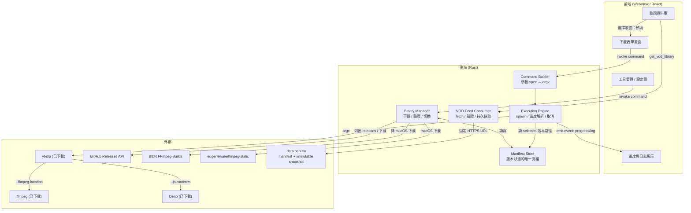
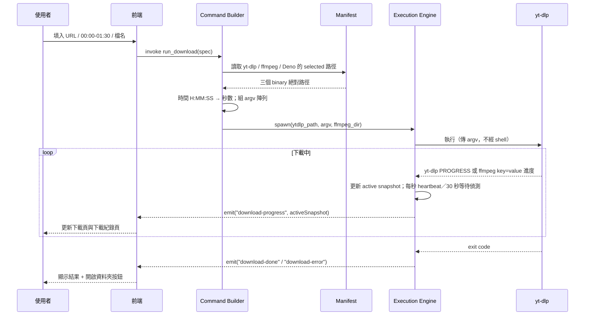
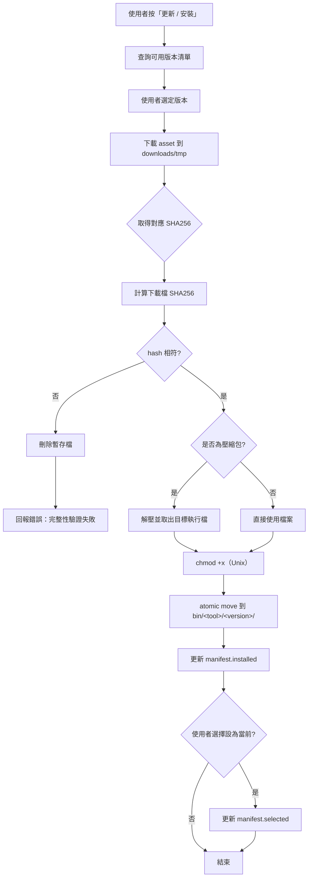
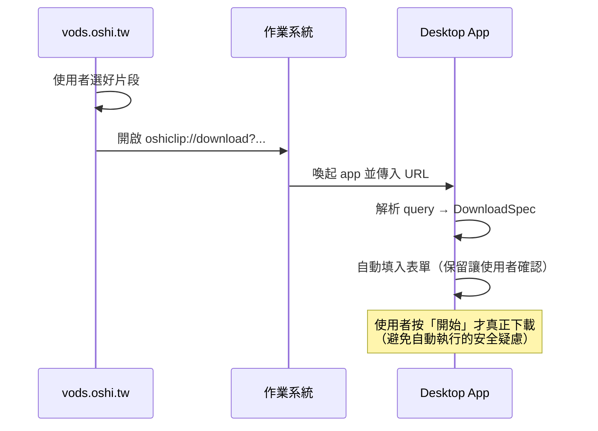
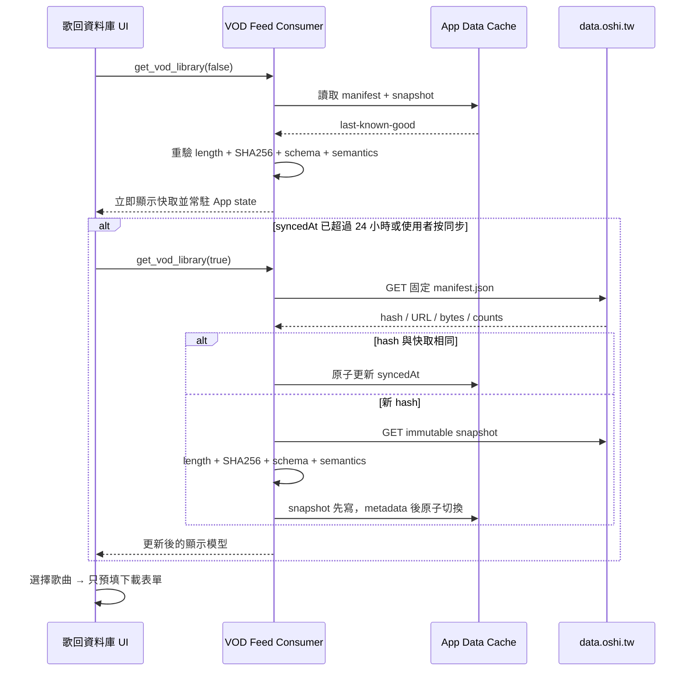

# OshiClip Desktop — 技術設計文件

| 項目 | 內容 |
|---|---|
| 文件狀態 | Implemented through Desktop next（v0.5.0 base） |
| 目標平台 | macOS (Intel/ARM)、Windows (x64)、Linux (x64/ARM64) |
| 核心技術 | Tauri v2 + Rust backend + React 19 / Vite 8 前端 |
| 相依外部工具 | yt-dlp、ffmpeg、Deno（皆為執行期下載，非打包散布） |
| 關聯專案 | prism.oshi.tw（資料生產）、data.oshi.tw（VOD v1 feed）、vods.oshi.tw（網頁 consumer） |

---

## 1. 概述

### 1.1 背景與問題陳述

本專案最初承接的 `vods.oshi.tw` 運作模式是：使用者在網頁上選好影片與時間區間，網頁產生一段 `yt-dlp` 指令，使用者自行複製到 macOS / Linux / Windows 的 terminal 執行。Prism 後續已將正式 VOD 資料發布為 `data.oshi.tw` v1 snapshot，因此桌面 App 也可直接成為受控 consumer，不再強制經過網站 UI。

實際使用回饋顯示，**大量使用者不熟悉終端機操作**，導致：

- 不知道如何安裝 yt-dlp / ffmpeg / JavaScript runtime，或安裝了但不在 PATH。
- Windows 的引號跳脫與 `--%` 語法容易貼錯。
- yt-dlp 版本過舊導致 YouTube 端變更後失效，但使用者不知如何更新。
- 找不到輸出檔案、或不理解錯誤訊息。

### 1.2 目標（Goals）

- **零終端機**：使用者全程透過 GUI 完成下載與剪輯，不需接觸 terminal。
- **自帶工具鏈**：app 負責下載、驗證、管理 yt-dlp、ffmpeg 與 Deno，使用者不需自行安裝。
- **版本可控**：使用者可在 GUI 內更新工具、切換版本、回退到舊版。
- **跨平台一致**：三平台行為與 UX 一致，維護一套程式碼。
- **與網頁銜接**：能承接 `vods.oshi.tw` 產生的參數（理想為一鍵開啟）。
- **直接資料探索**：從 `data.oshi.tw` 的已驗證正式資料搜尋 VOD／歌曲，直接帶入既有下載流程。

### 1.3 非目標（Non-Goals）

- 不做影片後製編輯器（裁切畫面、加字幕、轉場等）；本 app 專注於「片段下載 + remux」。
- 不自行實作下載邏輯；一律委派給 yt-dlp。
- 不散布 yt-dlp / ffmpeg / Deno 二進位（見 §11 授權考量）；一律由使用者端執行期下載。
- 首版不做批次佇列 / 排程（列入 Roadmap）。

---

## 2. 需求

### 2.1 功能需求（Functional Requirements）

| 編號 | 需求 |
|---|---|
| FR-1 | 使用者可輸入 YouTube URL、起訖時間、輸出檔名，執行片段下載。 |
| FR-2 | 顯示即時下載階段、百分比或動態進度、已寫入大小、速度、ETA／耗時與等待回應狀態。 |
| FR-3 | 首次啟動時偵測工具是否就緒，若無則引導下載 yt-dlp / ffmpeg / Deno。 |
| FR-4 | 設定頁可列出已安裝版本、檢查更新、切換 selected 版本、移除舊版。 |
| FR-5 | 下載任一二進位後，驗證 SHA256 一致才視為安裝成功。 |
| FR-6 | 可取消進行中的下載任務。 |
| FR-7 | 完成後可一鍵開啟輸出檔所在資料夾。 |
| FR-8 |（進階）承接來自 `vods.oshi.tw` 的深層連結參數並自動帶入表單。 |
| FR-9 | 直接讀取 `data.oshi.tw` VOD v1 feed，提供搜尋、VTuber 篩選、VOD 歌曲時間軸與下載預填。 |
| FR-10 | 下載紀錄頁置頂顯示進行中任務，切換分頁後仍可觀察並返回任務。 |
| FR-11 | 從歌回資料庫帶入時，輸出檔名支援 metadata 標籤模板、即時實際檔名預覽與本機格式持久化。 |

### 2.2 非功能需求（Non-Functional Requirements）

| 面向 | 要求 |
|---|---|
| 安裝體積 | 主程式 bundle < 20 MB（工具鏈執行期下載，不計入）。 |
| 完整性 | 所有下載的二進位須通過 SHA256 驗證；驗證失敗不得留下半成品。 |
| 資料信任 | VOD snapshot 須驗證 trusted URL、byte length、SHA256、schema、語意、ordering 與 counts 後才可顯示。 |
| 原子性 | 版本安裝 / 切換須為原子操作，中途失敗不破壞既有可用版本。 |
| 跨平台一致性 | 版本狀態不得依賴平台特性（如 symlink），須由 manifest 統一管理。 |
| 可觀測性 | 保留 yt-dlp / ffmpeg 的完整 stdout/stderr 供除錯。 |
| 離線容忍 | 工具已就緒時，離線仍可執行本機已下載完成的任務（下載影片本身需連網）。 |

---

## 3. 技術選型

### 3.1 GUI 框架比較

| 面向 | **Tauri v2** | Electron | Wails | Flutter |
|---|---|---|---|---|
| Bundle 體積 | ~10 MB | ~150 MB | ~10 MB | ~20 MB |
| 記憶體佔用 | 低 | 高 | 低 | 中 |
| 子行程 / sidecar 管理 | 一級公民（`tauri-plugin-shell`） | 需自行接 `child_process` | 尚可 | 需 platform channel |
| 三平台簽章成熟度 | 高 | 最高 | 中 | 中 |
| 後端語言 | Rust | Node.js | Go | Dart |
| 既有經驗契合度 | 高（Rust、且已處理過 Tauri v2 簽章） | 中 | 低 | 低 |

### 3.2 決策：Tauri v2

選用理由：

1. **子行程管理是核心需求**，Tauri 的 shell plugin 對「spawn 外部 binary + 串流 stdout + 傳 argv 陣列」支援完整，正好對應本 app 的執行模型。
2. **體積與資源**：對「工具封裝殼」這類 app，Electron 的 150 MB 基底不划算。
3. **簽章路徑已熟悉**，降低三平台發佈的未知風險。
4. 後端用 Rust 撰寫二進位管理器（下載、hash 驗證、原子安裝）型別安全、無 GC 停頓，且錯誤處理明確。

前端框架建議 **React**（既有熟悉度，可沿用網頁端元件思維）；若想壓更小體積可考慮 Svelte，但差異對本專案不關鍵。

### 3.3 關鍵決策：不使用官方 Sidecar 打包流程

Tauri 官方 sidecar 假設 binary 於**打包時**放入，並會驗證 target-triple 檔名後綴（如 `yt-dlp-x86_64-apple-darwin`）。本專案的二進位是**執行期下載到 app data 目錄**，因此：

- **不採用** `externalBin` 打包 sidecar 流程。
- 改以 `tauri-plugin-shell` 的 `Command::new(<絕對路徑>)`，指向自管目錄中由 manifest 解析出的當前版本 binary。

這是本設計最容易誤觸的坑：硬套官方 sidecar 會與「執行期下載 + 多版本切換」的需求衝突。

---

## 4. 系統架構

### 4.1 分層架構



### 4.2 模組職責

| 模組 | 職責 |
|---|---|
| **Command Builder** | 將前端傳來的參數 spec（URL、起訖秒數、格式 preset、輸出檔名）轉為 argv 陣列。**不組字串**，避免跨平台引號問題。 |
| **Binary Manager** | 查詢可用版本、下載、SHA256 驗證、原子安裝、切換 selected、移除版本。是 §6 的實作主體。 |
| **Execution Engine** | 以 argv spawn yt-dlp、串流 stdout/stderr、解析進度並 emit 事件、支援取消（kill 子行程樹）。 |
| **Manifest Store** | 讀寫 `manifest.json`，是「哪些版本已安裝 / 當前選哪個」的**唯一真相來源**。 |
| **VOD Feed Consumer** | 從固定 `data.oshi.tw` v1 manifest 取得 immutable snapshot，完成大小、SHA256、schema 與語意驗證，並保留可跨重啟使用的 last-known-good 磁碟快取。 |

---

## 5. 資料流：一次片段下載



---

## 6. 二進位管理設計（核心）

### 6.1 目錄結構

所有自管檔案置於 Tauri 的 app data 目錄（`app_data_dir()`）下：

```
{app_data_dir}/
├── bin/
│   ├── yt-dlp/
│   │   ├── 2025.10.01/
│   │   │   └── yt-dlp            (Windows: yt-dlp.exe)
│   │   └── 2025.11.15/
│   │       └── yt-dlp
│   ├── ffmpeg/
│   │   ├── 6.1.1/             (macOS provider 版本)
│   │   │   └── ffmpeg           (Windows: ffmpeg.exe)
│   │   └── n8.1/
│   │       └── ffmpeg
│   └── deno/
│       └── v2.9.2/
│           └── deno             (Windows: deno.exe)
├── downloads/                   # 下載暫存區；完成驗證後才 move 進 bin/
├── vod-library/
│   ├── cache.json              # cache schema、上次同步時間與已驗證 manifest
│   └── snapshots/{sha256}.json # content-addressed last-known-good 原始資料
└── manifest.json                # 版本狀態的唯一真相
```

設計要點：

- **多版本並存**：每個版本獨立資料夾，切換版本 = 改 manifest 的 `selected`，不動檔案。
- **「當前版本」不用 symlink**：Windows 的 symlink 需要特殊權限、行為不一致。統一改由 `manifest.json` 記錄 `selected`，三平台行為完全相同（見 §2.2 一致性要求）。
- **downloads/ 與 bin/ 分離**：下載中的檔案永遠不在 `bin/`，避免程式看到半成品。

### 6.2 manifest.json Schema

```jsonc
{
  "schema_version": 2,
  "tools": {
    "yt-dlp": {
      "selected": "2025.11.15",           // 當前使用版本；null 表示尚未安裝
      "installed": [
        {
          "version": "2025.11.15",
          "path": "bin/yt-dlp/2025.11.15/yt-dlp",   // 相對 app_data_dir
          "sha256": "3b2f...e91a",
          "source_url": "https://github.com/yt-dlp/yt-dlp/releases/download/2025.11.15/yt-dlp_macos",
          "size_bytes": 12648420,
          "installed_at": "2025-11-20T10:30:00Z"
        }
      ]
    },
    "ffmpeg": {
      "selected": "6.1.1",
      "installed": [
        {
          "version": "6.1.1",
          "path": "bin/ffmpeg/6.1.1/ffmpeg",
          "sha256": "a17c...44bd",
          "source_url": "https://github.com/eugeneware/ffmpeg-static/releases/download/b6.1.1/ffmpeg-darwin-arm64",
          "size_bytes": 79214592,
          "installed_at": "2025-11-20T10:32:10Z"
        }
      ]
    },
    "deno": {
      "selected": "v2.9.2",
      "installed": [
        {
          "version": "v2.9.2",
          "path": "bin/deno/v2.9.2/deno",
          "sha256": "61f4...b88c",
          "source_url": "https://github.com/denoland/deno/releases/download/v2.9.2/deno-aarch64-apple-darwin.zip",
          "size_bytes": 104857600,
          "installed_at": "2026-07-14T09:20:00Z"
        }
      ]
    }
  },
  "settings": {
    "output_directory": "/Users/example/Downloads/OshiClip"
  }
}
```

### 6.3 下載來源與 asset 對應

**yt-dlp**（GitHub Releases API：`GET /repos/yt-dlp/yt-dlp/releases`）

| 平台 | Asset 檔名 | 備註 |
|---|---|---|
| macOS | `yt-dlp_macos` | universal binary，同時支援 Intel / ARM，不需分架構 |
| Linux x64 | `yt-dlp_linux` | |
| Linux ARM64 | `yt-dlp_linux_aarch64` | |
| Windows | `yt-dlp.exe` | |

完整性檔：release 附 `SHA2-256SUMS`，用於驗證。

**ffmpeg**（官方不出 binary，依平台選擇來源）

| 平台 | 來源 / Asset 樣式 | 備註 |
|---|---|---|
| macOS ARM64 | [eugeneware/ffmpeg-static](https://github.com/eugeneware/ffmpeg-static) / `ffmpeg-darwin-arm64` | 直接二進位；使用 GitHub asset `digest` 驗證 |
| macOS Intel | eugeneware/ffmpeg-static / `ffmpeg-darwin-x64` | 同上 |
| Linux x64 | [BtbN/FFmpeg-Builds](https://github.com/BtbN/FFmpeg-Builds) / `ffmpeg-nX.Y-latest-linux64-gpl[-X.Y].tar.xz` | 解壓後尋找 `ffmpeg` |
| Linux ARM64 | BtbN/FFmpeg-Builds / `ffmpeg-nX.Y-latest-linuxarm64-gpl[-X.Y].tar.xz` | 解壓後尋找 `ffmpeg` |
| Windows x64 | BtbN/FFmpeg-Builds / `ffmpeg-nX.Y-latest-win64-gpl[-X.Y].zip` | 解壓後尋找 `ffmpeg.exe` |

> BtbN 現行 release 不提供 macOS asset，因此 macOS 改用有 ARM64 / x64 的 ffmpeg-static。BtbN 壓縮包不寫死內部目錄，解壓後以檔名尋找目標 binary。

**Deno**（GitHub Releases API：`GET /repos/denoland/deno/releases`）

| 平台 | Asset 檔名 |
|---|---|
| macOS ARM64 | `deno-aarch64-apple-darwin.zip` |
| macOS Intel | `deno-x86_64-apple-darwin.zip` |
| Linux ARM64 | `deno-aarch64-unknown-linux-gnu.zip` |
| Linux x64 | `deno-x86_64-unknown-linux-gnu.zip` |
| Windows x64 | `deno-x86_64-pc-windows-msvc.zip` |

yt-dlp 於 2025.11 起將 YouTube 完整支援需要外部 JavaScript runtime；專案採用 yt-dlp 官方首選的 Deno，並以 `--no-js-runtimes --js-runtimes deno:<absolute-path>` 鎖定自管版本。Deno asset 以 GitHub `digest` 或同 release 的 `.sha256sum` 驗證。

**完整性來源優先順序**：GitHub Releases API 的 asset `digest` → release 附帶的 SHA256 檔。只有至少一種可驗證來源時才列出為可安裝版本。

### 6.4 下載 / 驗證 / 安裝流程



**原子性保證**：`move` 前所有工作都在 `downloads/`；任一步失敗即刪暫存、不觸碰 `bin/` 與 `manifest.json`。因此**既有可用版本永不被破壞**。`manifest.json` 本身以「寫入暫存檔 → rename 覆蓋」方式更新，避免寫入中途崩潰造成 manifest 損毀。

### 6.5 版本切換與移除

- **切換**：僅將 `tools.<tool>.selected` 改為目標版本字串，寫回 manifest。O(1)，不搬檔案。
- **移除**：從 `installed` 移除項目並刪除該版本資料夾；若刪除的正是 `selected`，須先要求使用者改選其他版本或清空（`selected = null`）。
- **保留策略**：預設可只保留最近 2～3 個版本，提供「清理舊版」按鈕。

---

## 7. 執行引擎設計

### 7.1 argv-first 呼叫模型

網頁端給人類複製的指令需要處理 shell 引號（Windows 的 `--%`、雙引號跳脫等）。**本 app 由程式直接以 argument array 呼叫，不經過 shell 解析**，因此這些跳脫問題完全消失。

```rust
use tauri_plugin_shell::ShellExt;

// spec 由 Command Builder 從前端表單轉換而來
let ytdlp    = manifest.selected_path("yt-dlp")?;   // 絕對路徑
let ffmpeg_dir = manifest.selected_dir("ffmpeg")?;  // ffmpeg 所在目錄
let deno      = manifest.selected_path("deno")?;     // 絕對路徑

let (mut rx, child) = app.shell()
    .command(ytdlp)
    .args([
        "--ignore-config",
        "--no-playlist",
        "--format", "bv[vcodec^=avc1]+ba[acodec^=mp4a]/b[vcodec^=avc1][acodec^=mp4a]",
        "--merge-output-format", "mp4",
        "--remux-video", "mp4",
        "--no-force-keyframes-at-cuts",
        "--download-sections", &format!("*{start_sec}-{end_sec}"),
        "--no-overwrites",
        "--ffmpeg-location", ffmpeg_dir.to_str().unwrap(), // 明確指定，不靠系統 PATH
        "--no-js-runtimes",                                // 不自動探測系統 runtime
        "--js-runtimes", &format!("deno:{}", deno.display()),
        "--output", &output_template,
        "--newline",                                        // 進度逐行輸出，便於解析
        "--progress",                                       // --print 隱含 quiet，明確重新啟用進度
        "--progress-template", "download:PROGRESS %(progress._percent_str)s %(progress._speed_str)s %(progress._eta_str)s",
        "--downloader-args", "ffmpeg_o:-progress pipe:1 -nostats",
        "--print", "after_move:FINAL %(filepath)s",
        &url,
    ])
    .spawn()?;
```

要點：

- **`--ffmpeg-location`** 明確指向自管 ffmpeg，避免抓到使用者環境中殘缺的 ffmpeg 造成隨機失敗。
- **`--js-runtimes deno:<path>`** 明確指向自管 Deno，滿足現行 yt-dlp 對 YouTube JavaScript challenge 的需求，且不依賴系統 PATH。
- **`--download-sections '*4799-4993'`** 的秒數由前端 `H:MM:SS` 換算（與既有 songlist 時間軸處理一致）。
- 不需要 Windows 的 `--%`，那只在人工貼入 cmd 時才需要。

### 7.2 進度解析與事件

yt-dlp 原生下載以 `--progress-template` 自訂輸出；`--download-sections` 委派給 ffmpeg 時，則以 `-progress pipe:1` 取得 `key=value` 時間軸。Execution Engine 會緩衝可能被切斷的 UTF-8 行、把 `out_time_us / clip_duration` 轉成百分比，並將完整 active snapshot 寫入記憶體與送往前端。

另外每秒會送出 heartbeat 並觀察 `.part` 大小。若 30 秒沒有程序輸出或檔案成長，只把階段標記為 `waiting` 並提示使用者，保留取消與自行恢復的機會，不會武斷終止慢速下載。成功 exit 前百分比上限為 99.9，避免把尚未完成的 remux 誤報為完成。

yt-dlp 標準進度的解析格式如下：

```rust
use tauri_plugin_shell::process::CommandEvent;

while let Some(event) = rx.recv().await {
    match event {
        CommandEvent::Stdout(bytes) => for line in stdout_decoder.push(&bytes) {
            // 可解析 PROGRESS，或累積 ffmpeg key=value 到 progress=end。
            update_active_snapshot_and_emit(line)?;
        },
        CommandEvent::Stderr(bytes) => for line in stderr_decoder.push(&bytes) {
            // yt-dlp 可能把 PROGRESS 寫到 stderr；其餘內容保留在日誌。
            parse_progress_or_emit_log(line)?;
        },
        CommandEvent::Terminated(payload) => {
            let ok = payload.code == Some(0);
            app.emit(if ok { "download-done" } else { "download-error" }, payload.code)?;
        }
        _ => {}
    }
}
```

### 7.3 行程生命週期

- **取消**：保存 `child` handle，使用者按取消時 `child.kill()`。注意 yt-dlp 可能已 fork ffmpeg，Windows 上需連同子行程樹一併終止（可用 job object 或 taskkill /T）。
- **鎖定**：同一時間限制同工具的下載任務數（避免多個 yt-dlp 搶寫同一輸出檔），首版可只允許單一任務。
- **輸出目錄**：由使用者於設定頁指定，預設為系統「下載」資料夾下的子目錄；完成後提供「在檔案總管中顯示」。

---

## 8. 平台特定考量

| 面向 | macOS | Windows | Linux |
|---|---|---|---|
| App 本體簽章 | 需 Developer ID 簽章 + notarization（已具經驗） | 建議 Code Signing 憑證（EV 最省 SmartScreen reputation） | 一般不需簽章；發 AppImage / deb / rpm |
| 下載的 binary 隔離 | 程式下載的檔案**不會**帶 `com.apple.quarantine`，故不觸發 Gatekeeper；仍建議下載後清 xattr 保險 | 子行程呼叫**不經** SmartScreen（SmartScreen 針對 installer） | 僅需 `chmod +x` |
| 「當前版本」機制 | 統一用 manifest，不用 symlink | 統一用 manifest（避免 junction 權限問題） | 統一用 manifest |
| 打包格式 | `.dmg` / `.app` | `.msi` / `.exe`（NSIS） | AppImage / `.deb` / `.rpm` |
| PATH 依賴 | 一律用絕對路徑呼叫，不依賴系統 PATH | 同左 | 同左 |

**核心原則**：凡涉及「當前版本」與「工具位置」，一律以 manifest + 絕對路徑處理，不依賴任何平台檔案系統特性，換取三平台完全一致的行為。

macOS release bundle 也必須是 self-contained：`otool -L` 只允許 `/System/Library` 與 `/usr/lib` 下的 Apple 系統函式庫。AppKit、WebKit、Foundation 與 `libSystem` 是 Tauri / macOS 必要的動態連結，macOS 不提供可供 App 靜態打包的版本。Linux `.tar.xz` 解壓使用 target-specific 的 `tar` 與純 Rust `lzma-rust2`（關閉 default features 與 unsafe optimization），不使用 `xz2`、`lzma-sys` 或 Homebrew `liblzma`。

Windows 首發 target 固定為 `x86_64-pc-windows-msvc`：以 `target-feature=+crt-static` 將 MSVC CRT 靜態編入，並由 `build.rs` 停用 Tauri 2.11 只靜態化 VCRUNTIME、仍動態選用 UCRT 的 legacy override；缺少 `crt-static` target feature 時 build 必須直接失敗。release 驗證以 `dumpbin /DEPENDENTS` 拒絕 `VCRUNTIME*`、`MSVCP*`、UCRT 與任何不在 Windows 系統目錄的 DLL。WebView2 是 Tauri 必要的 Microsoft 系統 runtime，不納入 App 靜態連結；NSIS / MSI 內嵌約 1.8 MB 的 WebView2 bootstrapper，在系統缺少 runtime 時協助安裝。Windows ARM64 使用者先透過 Windows 11 x64 emulation 執行 x64 build，待 FFmpeg provider 有一致的 ARM64 資產後才開放原生 ARM64 target。

---

## 9. 前端 UX 與資料流

### 9.1 主要畫面

- **下載表單**
  - YouTube URL 輸入（貼上後可自動抓標題預覽）。
  - 起訖時間：`H:MM:SS` 輸入元件，內部轉秒數。
  - 輸出檔名：一般 URL 使用 `oshiclip-{videoId}-{start}-{end}`；歌回資料提供 `<Streamer>-<歌曲名>-<歌手>-<歌回名稱>` 等標籤模板、點選插入與即時預覽。
  - 格式 preset 下拉（預設隱藏 avc1/mp4a 細節，進階使用者可展開）。
  - 「開始」按鈕 → 進度區。
- **進度區**：進度條、速度、ETA、可展開的日誌面板、取消按鈕、完成後「開啟資料夾」。
- **歌回資料庫**：搜尋 VTuber／VOD／歌曲／原唱、VTuber 篩選、日期排序、VOD 展開時間軸與「帶入下載」。
- **設定 / 工具管理頁**
  - yt-dlp、ffmpeg、Deno 各自列出：當前版本、已安裝版本清單、檢查更新、切換、移除。
  - 輸出目錄設定。

### 9.2 參數 spec

前後端以單一 spec 物件溝通，前端只負責蒐集、後端負責轉 argv：

```typescript
interface DownloadSpec {
  url: string;
  startSeconds: number;   // 由 H:MM:SS 換算
  endSeconds: number;
  outputName: string;     // 不含副檔名，後端補 %(ext)s
  formatPreset: "avc1_mp4a" | "best";  // 對應內建 --format 字串
}
```

這與網頁端「同一份參數 spec 產生指令」的概念一致，只是產物從「字串」變成「argv 陣列」。

標籤只存在前端預填階段。前端將 metadata 代入後會先執行 NFKC、路徑字元替換與 120 字上限，`DownloadSpec.outputName` 只會收到最終實際檔名；Rust 仍會做第二層檢查。上次有效模板以 `oshiclip.filename-template.v1` 保存在 WebView `localStorage`。

---

## 10. 與 vods.oshi.tw 整合

### 10.1 深層連結（Deep Link）

讓網頁「一鍵開啟 app 並帶入參數」，使用 Tauri v2 的 deep-link plugin 註冊自訂 URL scheme。主要格式為：

```
oshiclip://download?v=mLSIBfQWqB4&start=4799&end=4993&name=nagi-4799-4993
```

為相容既有 `vods.oshi.tw`，app 仍接受同參數格式的
`oshi-vods://download` legacy scheme。

流程：



設計原則：

- **帶入但不自動執行**：深層連結只預填表單，實際下載需使用者確認，避免惡意連結誘發未經同意的下載。
- **降級**：若使用者未安裝 app，網頁維持既有「複製指令」流程，兩者並存。
- 網頁可偵測 app 是否安裝（嘗試喚起 scheme + timeout fallback），動態顯示「用 App 開啟」或「複製指令」。

### 10.2 直接讀取 data.oshi.tw

`data.oshi.tw` 的 feed 刻意沒有瀏覽器 CORS，因此 WebView 不直接 fetch，也不把 production domain 加進 CSP。Rust command `get_vod_library` 使用固定 manifest URL，拒絕 redirect 與任意 snapshot host，並在資料進入前端前完成 consumer contract 要求的完整驗證。



候選資料失敗時不覆蓋已驗證快取。React App 在啟動後只取得一次資料集並跨分頁保留；磁碟快取讓重新啟動也不必先等網路。快取超過 24 小時才背景同步，也可按 icon 手動同步；失敗會回報 UI，但仍可繼續搜尋 last-known-good 資料。

---

## 11. 安全性與授權

### 11.1 供應鏈完整性

- 所有二進位下載後**強制 SHA256 驗證**，來源 hash 取自 GitHub asset `digest`、`SHA2-256SUMS`、`checksums.sha256` 或 `.sha256sum`。
- 驗證失敗一律丟棄，不留半成品、不更新 manifest。
- 下載一律走 HTTPS，並限定官方 release 網域。

### 11.2 授權策略（重要）

- yt-dlp 為 Unlicense（公眾領域），無散布疑慮。
- Deno 為 MIT License；本專案仍維持執行期下載，不將 runtime 放入 app bundle。
- **ffmpeg 的 BtbN GPL build 帶 x264/x265，屬 GPL**。若本 app 直接**打包散布**該 binary，會使散布行為落入 GPL downstream distributor 的義務範圍。
- **採用的規避策略**：ffmpeg、yt-dlp 與 Deno 皆由**使用者端執行期下載**，app 本身不散布這些 binary，責任邊界因此清楚。這也正好符合原始設計意圖。
- 剪輯 / remux 情境其實用不到 x264/x265 編碼器；若日後想進一步簡化授權，可評估改用 LGPL build 或精簡建置，但非首版必要。

---

## 12. 錯誤處理與邊界情況

| 情境 | 處理 |
|---|---|
| 任一工具尚未安裝就按下載 | 阻擋並導向工具管理頁引導安裝 yt-dlp、ffmpeg 與 Deno。 |
| SHA256 驗證失敗 | 刪暫存、明確提示「檔案可能損毀或被竄改，請重試」。 |
| 網路中斷（下載工具中） | 顯示重試；暫存檔清除。 |
| yt-dlp 版本過舊致 YouTube 端失效 | 錯誤面板提示「可能需更新 yt-dlp」，附一鍵前往更新。 |
| 使用者移除了 selected 版本 | 阻擋移除或要求先改選其他版本。 |
| 輸出檔已存在 | `--no-overwrites` 已避免覆蓋；UI 提示改名或開啟既有檔。 |
| ffmpeg 壓縮包結構變動 | 解壓後以「尋找名為 ffmpeg/ffmpeg.exe 的檔」定位，不寫死路徑。 |
| manifest.json 損毀 | 讀取失敗時以「掃描 bin/ 目錄重建 manifest」作為復原手段。 |

---

## 13. 專案骨架

### 13.1 目錄結構

```
oshiclip/
├── src/                      # 前端 (React)
│   ├── views/
│   │   ├── DownloadView.tsx
│   │   ├── ToolsView.tsx
│   │   └── VodLibraryView.tsx
│   ├── lib/
│   │   ├── desktop.ts        # invoke / event 封裝 + 瀏覽器模擬
│   │   ├── deepLink.ts       # 新舊 URL scheme 白名單解析
│   │   ├── deepLink.test.ts
│   │   ├── filenameTemplate.ts # 歌回 metadata 標籤代入 / 模板儲存
│   │   ├── time.ts           # 時間 / 檔名處理
│   │   ├── time.test.ts
│   │   └── vodLibrary.ts      # 搜尋 / 篩選 / 預填
│   ├── App.tsx
│   ├── types.ts
│   └── styles.css
├── src-tauri/
│   ├── src/
│   │   ├── lib.rs             # plugins / commands / shared state
│   │   ├── main.rs
│   │   ├── manifest.rs       # Manifest Store
│   │   ├── binary_manager.rs # 下載 / 驗證 / 安裝 / 切換
│   │   ├── command_builder.rs
│   │   ├── executor.rs       # spawn / 進度 / 取消
│   │   ├── models.rs
│   │   ├── vod_library.rs    # data.oshi.tw 讀取與驗證
│   │   └── error.rs
│   ├── capabilities/default.json
│   ├── Cargo.toml
│   └── tauri.conf.json
└── package.json
```

### 13.2 Cargo.toml 關鍵相依

```toml
[dependencies]
tauri = { version = "2", features = [] }
tauri-plugin-shell = "2"          # spawn 外部 binary
tauri-plugin-deep-link = "2"      # 承接 oshiclip:// 與 legacy 連結
tauri-plugin-single-instance = "2" # 已開啟 app 接收 deep link
tauri-plugin-dialog = "2"         # 輸出目錄選擇器
tauri-plugin-opener = "2"         # 在檔案總管顯示成品
serde = { version = "1", features = ["derive"] }
serde_json = "1"
reqwest = { version = "0.12", features = ["stream", "rustls-tls"] }  # 下載
sha2 = "0.10"                     # SHA256 驗證
tokio = { version = "1", features = ["full"] }
zip = "4"                         # 解 Windows ffmpeg / Deno zip
tempfile = "3"                    # app data 中的安全暫存目錄
url = "2"                         # YouTube / deep-link 白名單驗證
unicode-normalization = "0.1"     # VOD feed NFC 驗證

[target.'cfg(target_os = "linux")'.dependencies]
tar = { version = "0.4", default-features = false }
lzma-rust2 = { version = "0.16.5", default-features = false, features = ["std", "xz"] }
                                      # 純 Rust XZ decoder；不連結 liblzma
```

### 13.3 Binary Manager 實作摘要

Binary Manager 已實作為 Tauri commands，主要入口為：

```rust
#[tauri::command]
async fn list_available_versions(tool: Tool) -> AppResult<Vec<AvailableRelease>>;

#[tauri::command]
async fn install_tool(
    app: AppHandle,
    state: State<'_, AppState>,
    tool: Tool,
    version: Option<String>,
) -> AppResult<ApiInstalledVersion>;

#[tauri::command]
fn switch_tool_version(state: State<'_, AppState>, tool: Tool, version: String)
    -> AppResult<()>;

#[tauri::command]
fn remove_tool_version(state: State<'_, AppState>, tool: Tool, version: String)
    -> AppResult<()>;
```

`install_tool` 的實際保證：

1. 以全局 async lock 序列化安裝，避免兩個任務競爭 manifest。
2. 限定 HTTPS GitHub release 來源、最多 8 次 redirect、單檔最大 1 GB。
3. 下載時同步計算 SHA256；驗證前檔案僅存於 `downloads/` 的 `tempfile` 目錄。
4. 壓縮包只取出檔名符合當前工具的一般檔案，不信任 archive 內的路徑。
5. 通過後先 rename 到 `.install-*` staging 目錄，再原子 rename 為版本目錄。
6. manifest 寫入失敗時回滾新版本目錄；切換僅更新 `selected`；使用中的版本不可移除。

---

## 14. 開發里程碑

| 階段 | 目標 | 產出 | 狀態 |
|---|---|---|---|
| M1 — 骨架 | Tauri + React 專案、typed invoke / event 封裝 | 可執行的 desktop app | ✅ 完成 |
| M2 — Binary Manager | 下載 + SHA256 驗證 + manifest + 版本切換 | 可安裝 / 切換 / 移除 yt-dlp、ffmpeg、Deno | ✅ 完成 |
| M3 — Execution Engine | argv spawn + 進度事件 + 取消 | 單一任務、進度、日誌與取消 | ✅ 完成 |
| M4 — UX 打磨 | 表單驗證、錯誤面板、開啟資料夾、preset | 響應式下載與工具管理界面 | ✅ 完成 |
| M5 — 簽章與發佈 | 三平台簽章 / notarization / 安裝包 | 可散布的正式版 | ⏳ 待處理 |
| M6 — Deep Link | `oshiclip://` 承接 + legacy 相容 + 網頁端偵測降級 | app 端註冊、單實例、白名單預填 | 🟡 app 端完成；網頁端待接 |
| M7 — 歌回資料庫 | data.oshi.tw consumer + 搜尋／篩選／時間軸 + 下載預填 | 不經網站即可從正式資料選歌 | ✅ 完成 |

---

## 15. 未來擴充

- 批次佇列：多個片段排隊下載。
- 歌回資料庫篩選狀態持久化與常用 VTuber。
- 進階格式選項（音訊擷取、字幕、縮圖）。
- i18n（繁中 / 日文 / 英文）。

---

## 16. 已決策與待決事項

已決策：

- 前端採 React + TypeScript + Vite。
- 工具保持執行期下載，不內嵌於 app bundle。
- `oshiclip://` 與 legacy `oshi-vods://` 只允許 `download` host，並白名單驗證 video ID、整數時間與檔名；連結只預填，不自動執行。
- `data.oshi.tw` 只能由 Rust 後端透過固定 v1 路徑讀取；候選 snapshot 完整驗證後才會原子替換磁碟快取。上次成功同步超過 24 小時時，每次 App 啟動最多背景嘗試一次；選歌同樣只預填、不自動下載。

待決策：

1. **ffmpeg 長期來源**：是否維持現有的平台分流，或自建精簡 LGPL build？
2. **自動更新**：是否加入後台檢查與非強制更新提示？
3. **Deep Link 簽章**：白名單已阻止本機路徑注入；若未來連結包含私有任務，再加入 HMAC / 短效 token。
